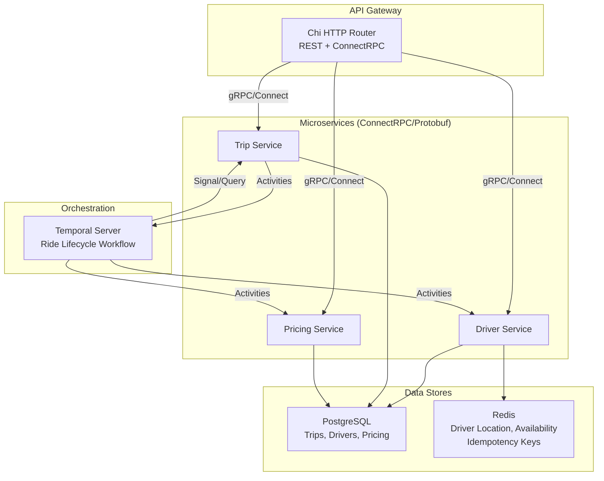

# Distributed Ride Dispatch Platform — 2-Week Roadmap

## Overview

Build a production-grade, distributed ride-dispatch backend in Go featuring three microservices communicating over ConnectRPC/Protobuf, orchestrated by Temporal workflows, backed by PostgreSQL + Redis, and fully containerized with Docker Compose.

> [!IMPORTANT]
> This plan assumes ~4-6 hours/day of focused coding. Each day has a clear deliverable so you always have something demo-able.

---

## Architecture at a Glance



---

## Tech Stack Summary

| Layer | Technology | Purpose |
|---|---|---|
| Language | **Go 1.22+** | Core backend |
| HTTP Router | **Chi** | REST endpoints, middleware |
| RPC | **ConnectRPC + Protobuf** | Typed inter-service communication |
| Schema Mgmt | **Buf** | Protobuf linting, code generation |
| Orchestration | **Temporal** | Durable workflow engine |
| Primary DB | **PostgreSQL** | Persistent trip/driver/pricing records |
| Cache/Realtime | **Redis** | Driver geo-location, availability, idempotency |
| Containers | **Docker + Docker Compose** | Local dev + deployment |

---

## Project Structure (Target)

```
Distributed-Ride-Dispatch-Platform/
├── proto/                          # Protobuf definitions
│   ├── buf.yaml
│   ├── buf.gen.yaml
│   ├── trip/v1/trip.proto
│   ├── driver/v1/driver.proto
│   └── pricing/v1/pricing.proto
├── gen/                            # Buf-generated Go code (gitignored)
├── cmd/
│   ├── trip-service/main.go        # Trip service entrypoint
│   ├── driver-service/main.go      # Driver service entrypoint
│   ├── pricing-service/main.go     # Pricing service entrypoint
│   └── worker/main.go              # Temporal worker entrypoint
├── internal/
│   ├── trip/
│   │   ├── handler.go              # ConnectRPC handlers
│   │   ├── repository.go           # PostgreSQL queries
│   │   └── service.go              # Business logic
│   ├── driver/
│   │   ├── handler.go
│   │   ├── repository.go
│   │   ├── service.go
│   │   └── matcher.go              # Driver-matching algorithm
│   ├── pricing/
│   │   ├── handler.go
│   │   ├── repository.go
│   │   └── service.go
│   ├── workflow/
│   │   ├── ride_workflow.go         # Temporal ride lifecycle workflow
│   │   └── activities.go            # Temporal activities
│   ├── middleware/
│   │   ├── idempotency.go           # Redis-backed idempotency
│   │   └── logging.go
│   └── config/
│       └── config.go                # Env-based configuration
├── migrations/                      # SQL migration files
├── docker-compose.yml
├── Dockerfile
├── Makefile
├── go.mod
├── go.sum
└── README.md
```

---

## Week 1: Core Infrastructure & Services

### Day 1 (Mon Sep 1) — Project Scaffolding & Docker Setup

**Goal:** Fully running local dev environment with all infra.

- [ ] Initialize Go module (`go mod init github.com/AnantaCoder/Distributed-Ride-Dispatch-Platform`)
- [ ] Create `docker-compose.yml` with:
  - PostgreSQL 16 (port 5432)
  - Redis 7 (port 6379)
  - Temporal Server + Temporal UI (ports 7233, 8233)
- [ ] Create `Makefile` with common targets: `up`, `down`, `proto-gen`, `migrate`, `run-*`
- [ ] Set up `internal/config/config.go` — env-based config with sensible defaults
- [ ] Verify all containers start cleanly with `docker compose up`

**Deliverable:** `docker compose up` brings up PG, Redis, Temporal — all healthy.

---

### Day 2 (Tue Sep 2) — Protobuf & Buf Setup

**Goal:** All three service APIs defined in Protobuf, code generated with Buf.

- [ ] Install Buf CLI, set up `buf.yaml` and `buf.gen.yaml`
- [ ] Define `proto/trip/v1/trip.proto`:
  - `RequestRide`, `GetTrip`, `CancelTrip`, `CompleteTrip`
  - Messages: `Trip`, `Location`, `TripStatus` enum
- [ ] Define `proto/driver/v1/driver.proto`:
  - `UpdateLocation`, `SetAvailability`, `GetNearbyDrivers`, `AssignDriver`, `GetDriver`
  - Messages: `Driver`, `DriverStatus` enum, `Location`
- [ ] Define `proto/pricing/v1/pricing.proto`:
  - `EstimatePrice`, `GetSurgeMultiplier`
  - Messages: `PriceEstimate`, `SurgeInfo`
- [ ] Run `buf generate` → verify Go + ConnectRPC code in `gen/`
- [ ] Add `buf lint` and `buf breaking` to CI checks

**Deliverable:** Clean `buf lint`, generated Go stubs compiling without errors.

---

### Day 3 (Wed Sep 3) — PostgreSQL Schema & Repositories

**Goal:** Database schema + repository layer for all three services.

- [ ] Create SQL migrations:
  ```sql
  -- 001_create_trips.sql
  CREATE TABLE trips (
      id UUID PRIMARY KEY DEFAULT gen_random_uuid(),
      passenger_id UUID NOT NULL,
      driver_id UUID,
      pickup_lat DOUBLE PRECISION NOT NULL,
      pickup_lng DOUBLE PRECISION NOT NULL,
      dropoff_lat DOUBLE PRECISION NOT NULL,
      dropoff_lng DOUBLE PRECISION NOT NULL,
      status TEXT NOT NULL DEFAULT 'REQUESTED',
      estimated_price_cents BIGINT,
      final_price_cents BIGINT,
      idempotency_key TEXT UNIQUE,
      created_at TIMESTAMPTZ DEFAULT NOW(),
      updated_at TIMESTAMPTZ DEFAULT NOW()
  );

  -- 002_create_drivers.sql
  CREATE TABLE drivers (
      id UUID PRIMARY KEY DEFAULT gen_random_uuid(),
      name TEXT NOT NULL,
      vehicle_plate TEXT NOT NULL,
      rating DOUBLE PRECISION DEFAULT 5.0,
      acceptance_rate DOUBLE PRECISION DEFAULT 1.0,
      total_trips INT DEFAULT 0,
      status TEXT NOT NULL DEFAULT 'OFFLINE',
      last_location_lat DOUBLE PRECISION,
      last_location_lng DOUBLE PRECISION,
      version INT DEFAULT 0,  -- optimistic concurrency
      created_at TIMESTAMPTZ DEFAULT NOW(),
      updated_at TIMESTAMPTZ DEFAULT NOW()
  );
  ```
- [ ] Implement repository layer using `pgx` (connection pooling with `pgxpool`)
  - `TripRepository`: Create, GetByID, UpdateStatus, UpdateDriver
  - `DriverRepository`: Create, GetByID, UpdateStatus (with optimistic locking), UpdateLocation
- [ ] Write unit tests for repositories using test containers or a test DB

**Deliverable:** Migrations run, CRUD operations pass tests.

---

### Day 4 (Thu Sep 4) — Driver Service + Redis Geo

**Goal:** Fully functional driver service with real-time location via Redis.

- [ ] Implement `internal/driver/service.go`:
  - `UpdateLocation()` — writes to Redis GEO (`GEOADD drivers:locations`) + updates PG
  - `SetAvailability()` — toggles driver status with **optimistic locking** (`version` column)
  - `GetNearbyDrivers()` — `GEORADIUS` / `GEOSEARCH` from Redis, filters by availability
- [ ] Implement `internal/driver/handler.go` — ConnectRPC handlers delegating to service
- [ ] Set up `cmd/driver-service/main.go`:
  - Chi router mounting ConnectRPC handler
  - Health check endpoint
  - Graceful shutdown
- [ ] **Concurrency safety**: Driver state transitions use `UPDATE ... WHERE version = $expected RETURNING version`
  - If 0 rows affected → version conflict → retry or error

**Key Interview Concept — Optimistic Concurrency Control:**
```go
// Prevents two concurrent ride-assignment attempts from both succeeding
func (r *DriverRepo) SetStatus(ctx context.Context, driverID uuid.UUID, 
    newStatus string, expectedVersion int) (int, error) {
    var newVersion int
    err := r.pool.QueryRow(ctx,
        `UPDATE drivers SET status = $1, version = version + 1, updated_at = NOW()
         WHERE id = $2 AND version = $3
         RETURNING version`, newStatus, driverID, expectedVersion).Scan(&newVersion)
    if err == pgx.ErrNoRows {
        return 0, ErrConcurrentModification
    }
    return newVersion, err
}
```

**Deliverable:** Driver service running, locations queryable via Redis geo commands.

---

### Day 5 (Fri Sep 5) — Pricing Service + Trip Service (Basic)

**Goal:** Pricing estimation working, trip service accepting ride requests.

- [ ] Implement `internal/pricing/service.go`:
  - `EstimatePrice()` — Haversine distance × base rate × surge multiplier
  - `GetSurgeMultiplier()` — based on demand/supply ratio (count active trips vs available drivers in area)
- [ ] Implement `internal/trip/service.go`:
  - `RequestRide()` — creates trip record, calls pricing service, returns estimate
  - `GetTrip()` — fetches trip by ID
  - `CancelTrip()` — updates status if cancellable
- [ ] Implement `internal/trip/handler.go` and `cmd/trip-service/main.go`
- [ ] **Idempotency middleware** (`internal/middleware/idempotency.go`):
  - Client sends `Idempotency-Key` header
  - Redis `SET key NX EX 86400` — if already exists, return cached response
  - Prevents duplicate ride creation on retries

**Deliverable:** Can request a ride, get a price estimate, cancel a trip.

---

### Day 6 (Sat Sep 6) — Driver-Matching Algorithm

**Goal:** Intelligent driver selection considering multiple factors.

- [ ] Implement `internal/driver/matcher.go`:
  ```go
  type MatchCandidate struct {
      DriverID       uuid.UUID
      Distance       float64  // km from pickup
      Rating         float64  // 1-5
      AcceptanceRate float64  // 0-1
      IdleTime       time.Duration
  }

  type MatchConfig struct {
      DistanceWeight       float64 // default: 0.4
      RatingWeight         float64 // default: 0.25
      AcceptanceRateWeight float64 // default: 0.2
      IdleTimeWeight       float64 // default: 0.15
      MaxCandidates        int     // default: 10
      MaxRadiusKm          float64 // default: 5.0
  }

  // Score = w1*(1-normDist) + w2*normRating + w3*acceptRate + w4*normIdleTime
  func (m *Matcher) RankDrivers(candidates []MatchCandidate) []MatchCandidate
  ```
- [ ] Integration: `FindBestDriver(ctx, pickupLocation)`:
  1. Redis `GEOSEARCH` → get nearby available driver IDs
  2. Batch-fetch driver metadata from PG
  3. Score & rank → return top candidate
- [ ] Write table-driven unit tests for scoring edge cases
- [ ] Handle edge case: no drivers available → return error for retry

**Deliverable:** Given a pickup location, returns the best-ranked driver.

---

### Day 7 (Sun Sep 7) — Review, Refactor, Buffer Day

**Goal:** Clean up Week 1, ensure everything integrates.

- [ ] End-to-end manual test: Request ride → estimate price → find driver
- [ ] Add structured logging (slog) across all services
- [ ] Add request ID propagation through Chi middleware
- [ ] Write integration tests for cross-service flows
- [ ] Refactor any code smells
- [ ] Update README with setup instructions

**Deliverable:** All three services running together, clean code, passing tests.

---

## Week 2: Temporal Workflows, Polish & Interview Prep

### Day 8 (Mon Sep 8) — Temporal Workflow Setup

**Goal:** Basic Temporal workflow for ride lifecycle.

- [ ] Set up `cmd/worker/main.go` — Temporal worker connecting to Temporal server
- [ ] Define `internal/workflow/ride_workflow.go`:
  ```go
  func RideLifecycleWorkflow(ctx workflow.Context, req RideRequest) (*RideResult, error) {
      // 1. Estimate pricing (Activity)
      // 2. Find & assign driver (Activity with retry policy)
      // 3. Wait for driver response (Signal with timeout)
      // 4. If accepted → wait for pickup confirmation
      // 5. Wait for trip completion
      // 6. Calculate final price (Activity)
      // 7. Update records (Activity)
  }
  ```
- [ ] Define activities in `internal/workflow/activities.go`:
  - `EstimatePriceActivity`
  - `FindAndAssignDriverActivity`
  - `UpdateTripStatusActivity`
  - `CalculateFinalPriceActivity`
- [ ] Register workflow + activities with worker

**Deliverable:** Workflow runs end-to-end with hardcoded happy path.

---

### Day 9 (Tue Sep 9) — Temporal Signals, Timeouts & Recovery

**Goal:** Production-grade workflow with real-world failure handling.

- [ ] **Driver response signal:**
  ```go
  // Driver accepts or rejects via signal
  driverResponseCh := workflow.GetSignalChannel(ctx, "driver-response")
  
  // Wait with timeout — if driver doesn't respond in 30s, try next driver
  timerCtx, _ := workflow.WithDeadline(ctx, workflow.Now(ctx).Add(30*time.Second))
  driverResponseCh.Receive(timerCtx, &response)
  
  if timerCtx.Err() == temporal.ErrDeadlineExceeded {
      // Mark driver as non-responsive, try next candidate
  }
  ```
- [ ] **Retry policies on activities:**
  ```go
  activityOpts := workflow.ActivityOptions{
      StartToCloseTimeout: 10 * time.Second,
      RetryPolicy: &temporal.RetryPolicy{
          InitialInterval:    time.Second,
          BackoffCoefficient: 2.0,
          MaximumAttempts:    3,
      },
  }
  ```
- [ ] **Multi-driver attempt loop**: Try up to 3 drivers before failing the ride
- [ ] **Cancellation handling**: Listen for cancel signal, clean up state
- [ ] **Saga-style compensation**: If workflow fails after driver assignment, release the driver

**Key Interview Concept — Durable Execution:**
> "Even if the worker crashes mid-workflow, Temporal replays the event history to recover exact state. Activities are retried with configurable backoff. Signals allow external events (driver accepting) to advance the workflow. This gives us crash-resistant, long-running business processes without manual state machine management."

**Deliverable:** Full ride lifecycle: request → match → driver signal → pickup → complete, with failure recovery.

---

### Day 10 (Wed Sep 10) — Idempotency & Concurrency Deep-Dive

**Goal:** Bulletproof duplicate handling and race condition prevention.

- [ ] **Ride-level idempotency:**
  - `RequestRide` checks `idempotency_key` UNIQUE constraint in PG
  - Redis `SET ride:idem:{key} {trip_id} NX EX 3600` for fast-path dedup
  - Temporal `WorkflowIDReusePolicy: REJECT_DUPLICATE` using idempotency key as workflow ID
- [ ] **Driver assignment idempotency:**
  - Activity uses `UPDATE drivers SET status='ASSIGNED' WHERE id=$1 AND status='AVAILABLE' AND version=$2`
  - If 0 rows → driver already taken → return specific error → workflow tries next driver
- [ ] **Test scenarios:**
  - Concurrent ride requests with same idempotency key
  - Two workflows trying to assign the same driver simultaneously
  - Worker crash during activity execution → verify Temporal retries correctly
- [ ] Add idempotency integration tests

**Deliverable:** Demonstrated duplicate prevention under concurrent load.

---

### Day 11 (Thu Sep 11) — API Gateway & End-to-End Flow

**Goal:** Unified API gateway, full REST + gRPC flow working.

- [ ] Create API gateway (`cmd/gateway/main.go` or extend trip-service):
  - Chi router with REST endpoints that proxy to ConnectRPC services
  - `POST /api/v1/rides` → Trip Service `RequestRide`
  - `GET /api/v1/rides/:id` → Trip Service `GetTrip`
  - `POST /api/v1/rides/:id/cancel` → Trip Service `CancelTrip`
  - `POST /api/v1/drivers/:id/location` → Driver Service `UpdateLocation`
  - `POST /api/v1/drivers/:id/respond` → sends Temporal signal
- [ ] Add Chi middleware stack: logging, request-id, recovery, CORS, rate-limit
- [ ] Full end-to-end test via HTTP:
  1. Seed drivers with locations
  2. Request ride → workflow starts
  3. Driver responds via signal endpoint
  4. Trip completes
- [ ] Test with `curl` or a simple script

**Deliverable:** Complete ride lifecycle testable via REST API.

---

### Day 12 (Fri Sep 12) — Docker, Multi-Stage Build, Compose

**Goal:** Entire platform runs with a single `docker compose up`.

- [ ] Create multi-stage `Dockerfile`:
  ```dockerfile
  FROM golang:1.22-alpine AS builder
  WORKDIR /app
  COPY go.mod go.sum ./
  RUN go mod download
  COPY . .
  RUN CGO_ENABLED=0 go build -o /bin/trip-service ./cmd/trip-service
  RUN CGO_ENABLED=0 go build -o /bin/driver-service ./cmd/driver-service
  RUN CGO_ENABLED=0 go build -o /bin/pricing-service ./cmd/pricing-service
  RUN CGO_ENABLED=0 go build -o /bin/worker ./cmd/worker

  FROM alpine:3.19
  COPY --from=builder /bin/* /usr/local/bin/
  ```
- [ ] Update `docker-compose.yml` with all services + health checks + dependency ordering
- [ ] Add migration runner as init container / startup script
- [ ] Verify clean `docker compose up --build` → all services healthy
- [ ] Add `.env.example` with all config vars documented

**Deliverable:** `docker compose up` starts everything — PG, Redis, Temporal, all services.

---

### Day 13 (Sat Sep 13) — Testing, README & Documentation

**Goal:** Comprehensive tests, polished documentation.

- [ ] Unit tests: matcher algorithm, pricing calculation, repository layer
- [ ] Integration tests: Temporal workflow (use Temporal test framework)
- [ ] Add a demo script (`scripts/demo.sh`) that:
  1. Seeds 10 drivers with random locations
  2. Requests 3 rides
  3. Simulates driver responses
  4. Shows trip status progression
- [ ] Write comprehensive README:
  - Architecture diagram
  - Quick start guide
  - API documentation
  - Design decisions & trade-offs
  - Interview talking points

**Deliverable:** Tests passing, README that impresses reviewers.

---

### Day 14 (Sun Sep 14) — Interview Prep & Final Polish

**Goal:** Be ready to explain every design decision confidently.

- [ ] Final code review — ensure code quality is demo-ready
- [ ] Practice explaining these key topics (see below)
- [ ] Record a demo walkthrough for yourself
- [ ] Push final version to GitHub

---

## Interview Preparation Guide

### Top Questions You Should Be Ready For

#### 1. "Why Temporal over a state machine?"
> "A hand-rolled state machine requires managing state persistence, retry logic, timeouts, and failure recovery manually. Temporal provides durable execution — the workflow function IS the state machine, but with automatic event sourcing, crash recovery, and built-in retry/timeout primitives. It eliminates an entire class of bugs around state consistency."

#### 2. "How does your driver-matching algorithm work?"
> "We query Redis GEOSEARCH for nearby available drivers within a configurable radius, then score them using a weighted formula: `Score = 0.4*(1 - normalized_distance) + 0.25*normalized_rating + 0.2*acceptance_rate + 0.15*normalized_idle_time`. This balances pickup speed with driver quality and fairness. Weights are configurable — in production you'd A/B test them."

#### 3. "How do you prevent duplicate driver assignments?"
> "Three layers: (1) Optimistic concurrency on the drivers table — `UPDATE ... WHERE version = expected_version`, (2) Temporal workflow ID uses the idempotency key, so duplicate requests get the same workflow, (3) Redis-based idempotency middleware catches duplicate HTTP requests before they reach the workflow."

#### 4. "Why Redis + PostgreSQL instead of just one?"
> "Redis gives us sub-millisecond geo-queries for driver locations and O(1) idempotency checks — critical for real-time dispatch. PostgreSQL gives us ACID transactions for trip records, relational integrity, and audit trails. The hot path (find nearby drivers) hits Redis; the durable path (record trip) hits Postgres."

#### 5. "What happens when a driver doesn't respond?"
> "The Temporal workflow uses a signal with a 30-second deadline. If the timer fires before the signal arrives, we mark that driver attempt as timed-out, release the driver (compensation), and loop to try the next-ranked candidate. After 3 failed attempts, the ride request fails and we notify the passenger."

#### 6. "How would you scale this?"
> "Services are stateless — horizontal scaling behind a load balancer. Redis handles geo-queries at scale. For PostgreSQL, read replicas for queries, partitioning trips by date. Temporal workers scale independently. The bottleneck is usually the matching + assignment — we could shard by geographic region for independent dispatch domains."

#### 7. "Walk me through a ride request end-to-end."
> "HTTP POST hits the API gateway → idempotency check in Redis → Trip Service creates the trip record → starts a Temporal workflow with the trip ID → workflow calls PricingService to estimate fare → calls DriverService to find the best driver via GEOSEARCH + scoring → assigns driver with optimistic lock → sends push notification (simulated) → waits for driver signal → on accept, transitions trip to DRIVER_EN_ROUTE → on pickup signal, transitions to IN_PROGRESS → on complete signal, calculates final fare and closes the workflow."

---

## Risk Mitigation

| Risk | Mitigation |
|---|---|
| Temporal setup complexity | Use official Docker image; start with simple workflow, add complexity incrementally |
| Buf/Protobuf learning curve | Follow Buf's Go tutorial on Day 2; ConnectRPC has excellent docs |
| Scope creep | Stick to the core flow — no auth, no payments, no real push notifications |
| Time pressure | Days 7 and 14 are buffer days — use them if you fall behind |

---

## What's Intentionally Out of Scope

These are things you should **mention in interviews** as "next steps" but don't need to build:

- Authentication/Authorization (JWT, OAuth)
- Payment processing
- Real push notifications (FCM/APNs)
- Kubernetes deployment
- Observability (OpenTelemetry, Prometheus, Grafana)
- Rate limiting at scale
- Geographic sharding
- WebSocket for real-time trip tracking

---

> [!TIP]
> **Start building today (Day 1).** The plan front-loads infrastructure so you can iterate on the interesting parts (Temporal, matching, concurrency) with a solid foundation. Each day's deliverable is independently demo-able.

## Verification Plan

### Automated Tests
- `go test ./...` — unit + integration tests
- Temporal test framework for workflow tests
- `buf lint` and `buf breaking` for proto validation

### Manual Verification
- `docker compose up` → all services healthy
- Demo script exercises full ride lifecycle via curl
- Concurrent request test to verify idempotency
