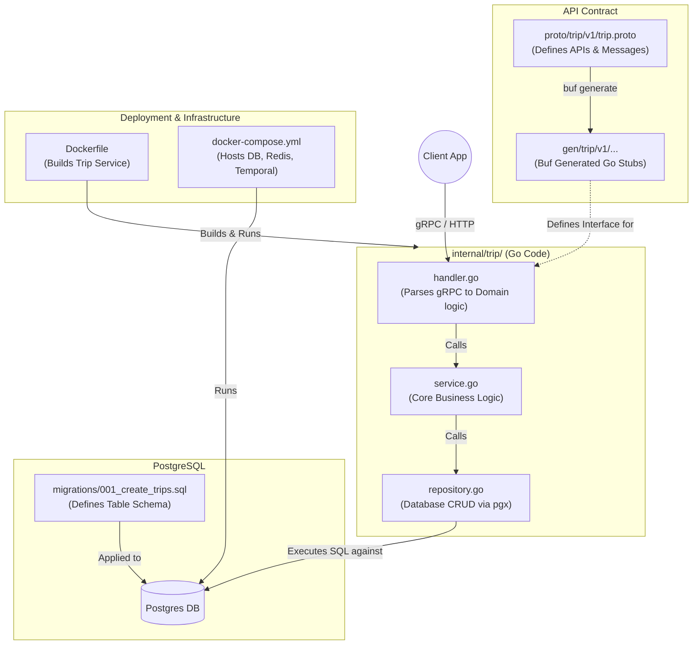
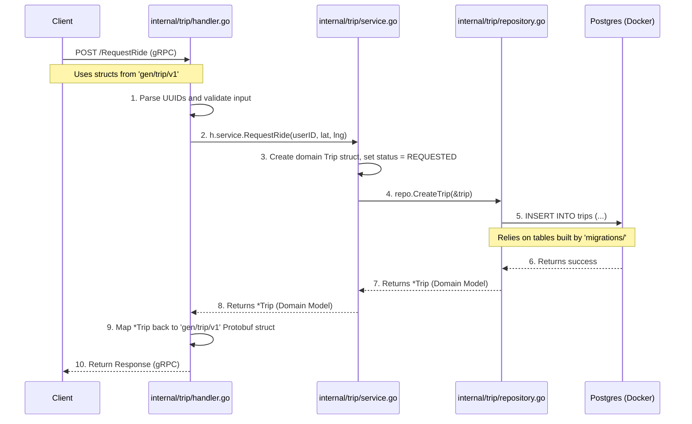

# Trip Service Architecture & Request Flow

This document visualizes how all the different components of the Trip service interact with each other. It shows how the API contract (`proto`), the generated code (`gen`), your application logic (`internal/trip`), the database (`migrations`), and the deployment (`Docker`) all come together.

## 1. System Components Overview

This diagram shows the structural relationship between the files you are working with.

### Component Roles:
- **`proto/trip`**: The source of truth. You define what the API looks like here.
- **`gen/`**: You don't write this. Buf generates this Go code from the `.proto` files so your server and clients can talk to each other safely.
- **`internal/trip/handler.go`**: The entry point for requests. It takes the generated `gen` structs, pulls out the data, and passes it to the `Service`.
- **`internal/trip/service.go`**: The brain of the application. It applies rules (e.g., "is the user allowed to request a ride?") and orchestrates the flow.
- **`internal/trip/repository.go`**: The hands of the application. It writes and reads pure SQL to talk to the database.
- **`migrations/`**: Defines the raw SQL tables (`CREATE TABLE...`) that the repository expects to exist in PostgreSQL.
- **`docker-compose.yml` & `Dockerfile`**: Packages your Go code and boots up the database so everything runs in a unified environment.

---

## 2. Request Flow (Sequence Diagram)

Here is exactly how a request flows through your files when someone tries to create a trip.

### How the Data Changes Forms
Notice how data changes form as it moves through the layers:
1. **At the Boundary (Client -> Handler):** Data is in **Protobuf format** (e.g., `tripv1.CreateTripRequest`).
2. **Inside the App (Handler -> Service -> Repo):** Data is in **Domain format** (e.g., standard Go `float64`, `uuid.UUID`, and your custom `Trip` struct).
3. **At the Database (Repo -> DB):** Data is in **SQL format** (queries and rows).

This separation is why `handler.go` maps the Protobuf fields into standard Go variables before calling `service.go`!
